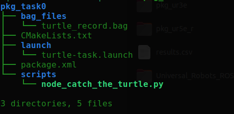

# Submission Instructions

> In total 3 things needs to uploaded to iLearn for submission.

1. A short video of expected output (of your solution).

1. Your package `pkg_task0` which should include these files.

    

    > Take special care of the naming.

1. Bag files as showing in recording logs section.

---